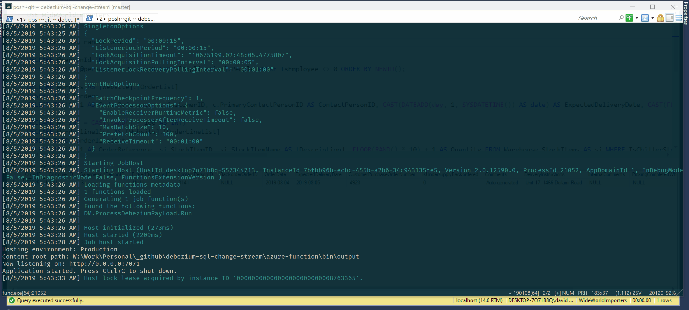

# Azure SQL / SQL Server Change Stream with Debezium

<!-- 
Guidelines on README format: https://review.docs.microsoft.com/help/onboard/admin/samples/concepts/readme-template?branch=master

Guidance on onboarding samples to docs.microsoft.com/samples: https://review.docs.microsoft.com/help/onboard/admin/samples/process/onboarding?branch=master

Taxonomies for products and languages: https://review.docs.microsoft.com/new-hope/information-architecture/metadata/taxonomies?branch=master
-->


Azure SQL Database and SQL Server Change Stream sample using [Debezium](https://debezium.io/). A change feed or change stream allow applications to access real-time data changes, using standard technologies and well-known API, to create modern applications using the full power of database like SQL Server.

Debezium make use of [Change Data Capture](https://docs.microsoft.com/en-us/sql/relational-databases/track-changes/about-change-data-capture-sql-server?view=sql-server-2017), so it can be used with SQL Server on-premises and the whole [Azure SQL](https://azure.microsoft.com/en-us/products/azure-sql) family (https://azure.microsoft.com/en-us/products/azure-sql) (Azure SQL MI, Azure SQL DB, SQL Server on VM).

With Debezium and Azure SQL / SQL Server you can not only create more modern and reactive applications that handle data changes in near real time with a minium impact on the database, but you can also use it to implement your Hybrid IT strategy, still using On-Prem SQL Server but relying on Azure for all your computing needs, taking advantage of PaaS offerings like EventHubs and Azure Functions. This sample will show how to do that.



For those who want more details, Debezium uses Apache Kafka, which is not natively available on Azure as a PaaS offer. But luckily EventHubs offer almost 100% support, so we can use it instead of Kafka and make maintenance and scalability easier.

[Event Hubs for Kafka](https://docs.microsoft.com/en-us/azure/event-hubs/event-hubs-for-kafka-ecosystem-overview)

## Step by Step Guide

This step by step guide uses Wide World Importers sample database from here:

https://github.com/Microsoft/sql-server-samples/releases/tag/wide-world-importers-v1.0

Make sure you download the OLTP database if you want to follow this guide without having to change a thing. To restore the database on Azure SQL, you can use the scripts provided here: [Restore Database in Azure SQL](https://github.com/yorek/azure-sql-db-samples/tree/master/samples/01-restore-database).

### Create Debezium User

Debezium needs to query the database so a dedicated user is used throughout the sample. User has `db_owner` access to make the script simpler. In real world you may want to tighten security a bit more.

To create the login and user run the script `00-setup-database-user.sql` from the `sql` folder (pertinent to the service or product you are using, Azure SQL or SQL Server / Azure SQL MI) on the database where you have restored Wide World Importers database.

### Enable Change Data Capture

Debezium uses Change Data Capture to capture all the changes done to selected tables.

In this samples only two tables are monitored:

- Sales.Orders
- Warehouse.StockItems

The script `01-enable-cdc.sql` enable Change Data Capture on the aforementioned tables.

### Create an Azure Event Hubs

All data gathered by Change Data Capture will be send to Event Hubs, so create an Azure Event Hubs in your Azure Subscription. Using the [Azure Cloud Shell](https://shell.azure.com/) Bash:

```bash
# create group
az group create -n debezium -l eastus

# create eventhuvbs with kafka enabled
az eventhubs namespace create -n debezium -g debezium -l eastus --enable-kafka
```

Later in the configuration process you'll need the EventHubs connection string, so grab it and store it somewhere:

```bash
az eventhubs namespace authorization-rule keys list -g debezium --namespace-name debezium -n RootManageSharedAccessKey --query "primaryConnectionString" -o tsv
 ```

### Run Debezium

#### Pre-Requisites

In order to run Debezium you have to install and configure Apache Kafka, Apache Zookeper and Kafka Connect. If you already know how to do that, or your already have a testing or development environment, well, perfect. Go and install Debezium SQL Server Connector: [Installing a Debezium Connector](https://debezium.io/docs/install/stable/#installing_a_debezium_connector).

If prefer a more lean and quick easy to start using Debezium, you can just use the [Debezium Docker Image](https://github.com/debezium/docker-images), that provides anything you need to run a test instance of Debezium. Just make sure you have [Docker](https://docs.docker.com/install/) and [Docker Compose](https://docs.docker.com/compose) installed. In the `debezium/on-prem` folder you can find all the scripts needed to run Debezium using Docker.

#### Configure Environment

Docker Compose will use `.env` to get the environment variables values used in the `.yaml` configuration file. The provided `.env.template` file look like the following:

```bash
DEBEZIUM_VERSION=1.6
EH_NAME=debezium
EH_CONNECTION_STRING=
```

Copy it and create a new `.env` file. Leave the version set to 1.6. Change the `EH_NAME` to the EventHubs name you created before. Also set `EH_CONNECTION_STRING` to hold the EventHubs connection string you got before. Make sure not to use any additional quotes or double quotes.

#### The .yaml file

If you are just interested in testing Debezium you can safely skip this section and move to the next one to start Debezium. If you want to understand how to make Debezium work with Event Hubs, read on.

Debezium needs Apache Kafka to run, NOT Azure Event Hubs. Luckily for us, Azure Event Hubs exposes a Kafka-Compatible endpoint, so we can still enjoy Kafka with all the comfort of a PaaS offering. There are a few tweeks needed in order to make Debezium working with Azure Event Hubs.

First of all EventHubs requires authentication. This part is taken care from the configuration settings that looks like the following:

```yaml
- *_SECURITY_PROTOCOL=SASL_SSL
- *_SASL_MECHANISM=PLAIN
- *_SASL_JAAS_CONFIG=[...]
```

Documentation on EventHubs Kafka Authentication and Kafka Connect is available here:

[Integrate Apache Kafka Connect support on Azure Event Hubs](https://docs.microsoft.com/en-us/azure/event-hubs/event-hubs-kafka-connect-tutorial)

Since we're running a Docker Image, we cannot really change the configuration file, but Debezium allows pass-through configurations:

[Debezium Connect-Base](https://github.com/debezium/docker-images/tree/master/connect-base)

There is additional caveat to keep in mind. EventHubs security uses the string `$ConnectionString` as username. In order to avoid to have Docker Compose to treat it as a variable instead, a double dollar sign `$$` needs to be used:

[Docker Compose Config File Variable Substitution](https://docs.docker.com/compose/compose-file/#variable-substitution)

Two other options useful for running Debezium on Azure Event Hubs are the following:

```yaml
- CONNECT_KEY_CONVERTER_SCHEMAS_ENABLE=false
- CONNECT_VALUE_CONVERTER_SCHEMAS_ENABLE=true
```

They control if the schema is sent with the data or not. Since the Azure Event Hubs only support values, as opposed to Apache Kafka, which everything is actually a key-value pair, the schema generation for the key section can be safely turned off. While this can also be done for the value part, it is not recommended as some data type are serialized in a Kafka-specific way and you need to know their "sematic" type in order to recreate the correct value.

[Debezium SQL Server Connector Data Types](https://debezium.io/docs/connectors/sqlserver/#data-types)

Here's a sample of a schema for a "create" (INSERT) event:

[Debezium SQL Server Connector Create Event Sample](https://debezium.io/docs/connectors/sqlserver/#create-events)

#### Start Debezium

Debezium can now be started. If you're using the Docker Images you can just do this by running `debezium/on-prem/start-debezium.ps1` (or the `.sh` file if you're on Linux/WSL)

Once the startup has finished, you'll see something like

```text
[Worker clientId=connect-1, groupId=1] Finished starting connectors and tasks   [org.apache.kafka.connect.runtime.distributed.DistributedHerder]
```

you will see three topics (or EventHub to use the Azure EventHubs nomenclature):

```bash
az eventhubs eventhub list -g debezium --namespace debezium -o table
```

and the result will show:

- debezium_configs
- debezium_offsets
- debezium_statuses

to explore Azure Event Hubs is strongly suggest to download and use [Service Bus Explorer](https://github.com/paolosalvatori/ServiceBusExplorer)

#### Register SQL Server Connector

Now that Debezium is running, the SQL Server Connector (which is used both for connecting to Azure SQL or SQL Server) can be registered. Before doing that, make sure to specify the correct connection for your SQL Server instance in the `debezium/register-sqlserver-eh.json` file. You can create one using the provided `.template` file.

If you are using the Wide World Importers database, the only values you have to change are:

```json
"database.hostname": "<server>.database.windows.net",
"database.dbname": "<database-name>",
```

If you are following the step-by-step guide using a database of yours, make sure to also correctly set values for

```json
"database.user" : "debezium-wwi",
"database.password" : "Abcd1234!",
```

All the other values used are explained in detail here:

[SQL Server Connector Configuration Values](./documentation/SQL-Server-Connector-Configuration-Value.md)

Once the configuration file is set, just register that using `debezium/on-prem/register-connector.ps1`.

Depending on how big your tables are, it make take a while (more on this later). Once you see the following message:

```text
Snapshot step 8 - Finalizing   [io.debezium.relational.HistorizedRelationalSnapshotChangeEventSource]
```

and no other errors or exception before that, you'll know that the SQL Server Connector is correctly running.

### Make sample changes

Now that Debezium is running and fully configured, you can generate a new Sales Order and insert, update and delete some data in the Stock table. You can use the following scripts:

```bash
./sql/.../02-create-new-sales-order.sql
./sql/.../03-modify-warehouse-stock.sql
```

After running the script you can use Service Bus Explorer or VS Code Event Hub Explorer to consume the stream of changes sent to Azure Event Hubs. You'll notice a new topic named `wwi`. That's where we instructed Debezium to send all the changes detected to the monitored tables.

### Consume Change Stream using an Azure Functions

One way to quickly react to the Change Stream data coming from Debezium is to use Azure Functions. A sample is available in folder `azure-function`. The easiest way to run the sample is to open it from VS Code or via [Azure Function Core Tools](https://docs.microsoft.com/azure/azure-functions/functions-run-local), via `func start`. It will automatically recognize it as an Azure Function and download everything needed to run it.

Make sure you have a `local.setting.json` that looks like the provided template. Copy the Azure Event Hubs connection string you got at the beginning into the `Debezium` configuration option.

Start the function. As soon as the Azure Function runtime is running, the code will start to process the changes already available in EventHubs and you'll see something like this:

```text
Event from Change Feed received:
- Object: Sales.Orders
- Operation: Insert
- Captured At: 2019-08-04T22:35:59.0100000Z
> OrderID = 73625
> CustomerID = 941
> SalespersonPersonID = 3
> PickedByPersonID =
> ContactPersonID = 3141
> BackorderOrderID =
> OrderDate = 8/4/2019 12:00:00 AM
> ExpectedDeliveryDate = 8/5/2019 12:00:00 AM
> CustomerPurchaseOrderNumber = 4923
> IsUndersupplyBackordered = False
> Comments = Auto-generated
> DeliveryInstructions = Unit 17, 1466 Deilami Road
> InternalComments =
> PickingCompletedWhen =
> LastEditedBy = 3
> LastEditedWhen = 8/4/2019 10:35:58 PM
Executed 'ProcessDebeziumPayload' (Succeeded, Id=ee9d1080-64ff-4039-83af-69c4b12fa85f)
```

### Done

Congratulations, you now have a working Change Stream from SQL Server. This opens up a whole new set of possibilities! Have fun!

## Notes

### Running Debezium on Azure

If you're using Debezium with Azure SQL MI or Azure SQL DB, you may want to run Debezium on Azure. Sample script to run the Debezium container on Azure Container Instances are available in the `debezium/azure` folder.

### Connector Configuration

More details on SQL Server and Event Hubs specific configuration here:

[SQL Server Connector Configuration Values](./documentation/SQL-Server-Connector-Configuration-Value.md)

## Troubleshooting

### Local Azure Function not working

If, after starting the Azure Function via `func start` you get the following error:

```
The listener for function 'ProcessDebeziumPayload' was unable to start. Microsoft.WindowsAzure.Storage: No connection could be made because the target machine actively refused it. System.Net.Http: No connection could be made because the target machine actively refused it. System.Private.CoreLib: No connection could be made because the target machine actively refused it.
```

you need to make sure that [Azure Storage Emulator](https://docs.microsoft.com/azure/storage/common/storage-use-azurite) is installed and started.
